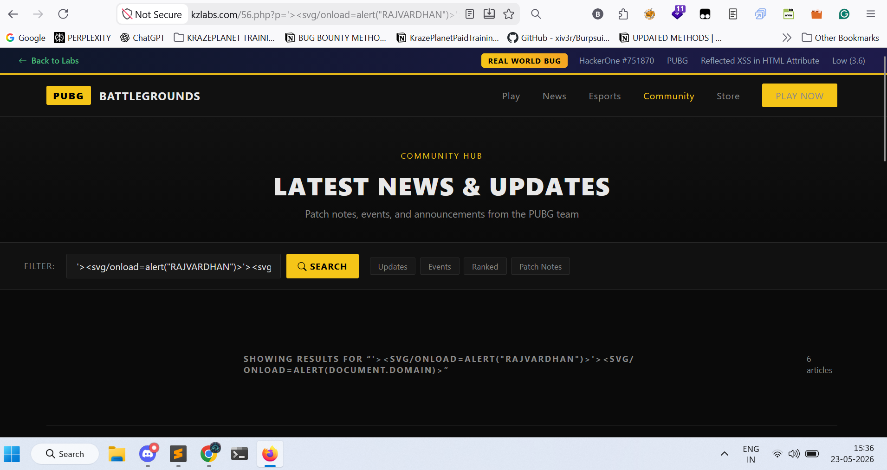
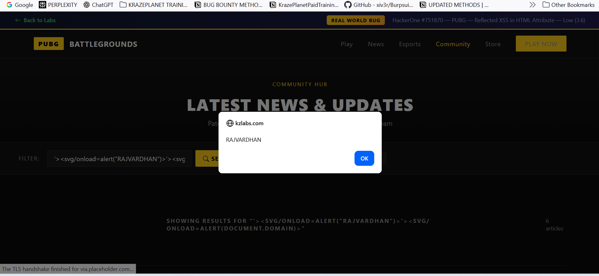

## Title
Reflected Cross-Site Scripting (XSS) in "p" Parameter

## Summary
I identified a reflected Cross-Site Scripting (XSS) vulnerability in the `p` parameter of the following endpoint:

## Vulnerable Endpoint
https://labs.krazeplanet.com/56.php?p=

## Steps to Reproduce
1. Open the following URL in a browser:
https://labs.krazeplanet.com/56.php?p='><svg/onload=alert("RAJVARDHAN")>

2. Observe that a JavaScript alert box is triggered immediately.

3. This confirms that arbitrary JavaScript supplied via the "p" parameter is executed in the browser.

## Payload Used
'><svg/onload=alert("RAJVARDHAN")>

# Proof of Concept
## Screenshot 1 — Malicious payload injected into the vulnerable parameter

## Screenshot 2 — JavaScript alert triggered successfully in the browser

This confirms the presence of a Reflected Cross-Site Scripting (XSS) vulnerability.

## Impact
- Cookie stealing
- Session hijacking
- Phishing attacks
- JavaScript execution in victim browser

## Remediation
1. filter all of tags like these: <script>, , <svg>
2. filter all of these methods: alert, confirm, prompt
3. If you're using PHP then use htmlspecialchars() function

