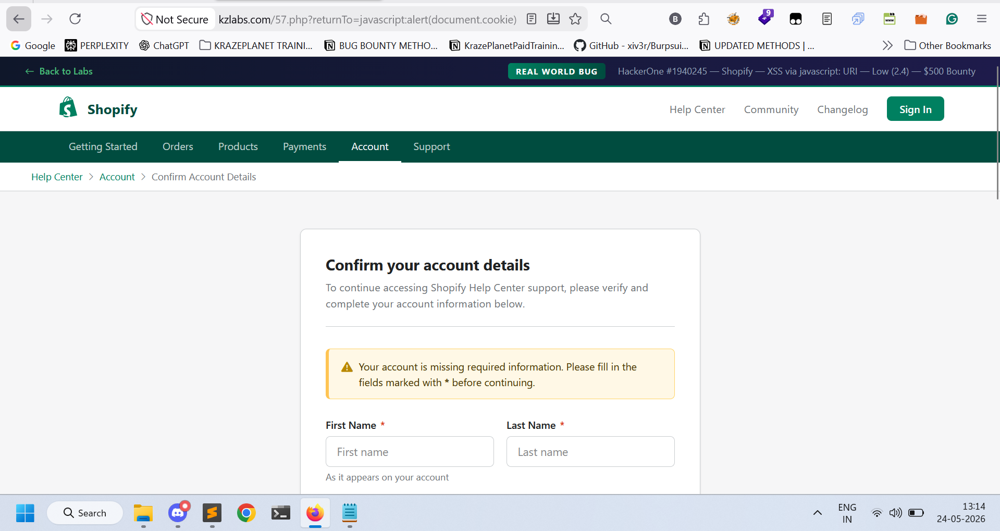
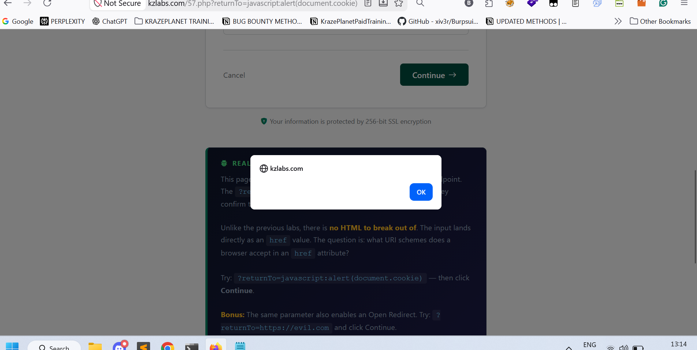
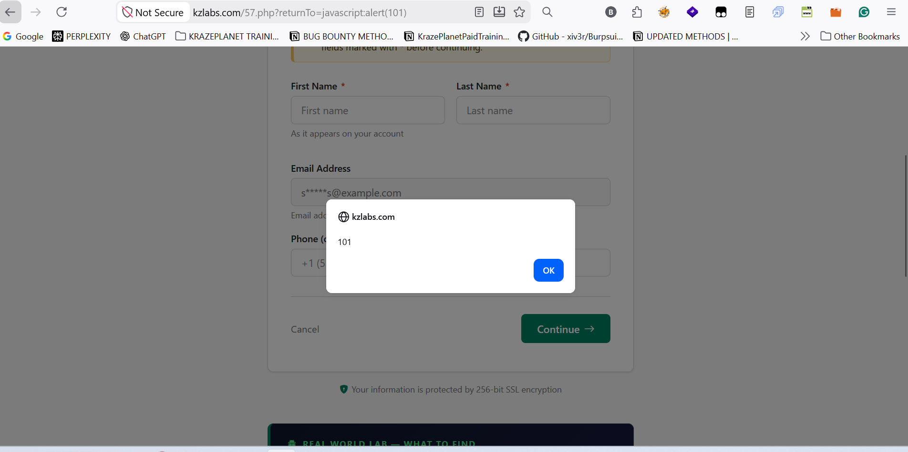

## Title
Open Redirect / JavaScript Injection via "returnTo" Parameter

## Summary
I identified a vulnerability in the "returnTo" parameter of the following endpoint:

## Vulnerable Endpoint
https://kzlabs.com/57.php?returnTo=

The application allows execution of JavaScript using the "javascript:" URI scheme inside the "returnTo" parameter.

When a user clicks on the "Continue" button, the supplied JavaScript executes in the victim's browser.

## Steps to Reproduce

1. Open the following URL in a browser:

https://kzlabs.com/57.php?returnTo=javascript:alert(101)

2. Click on the "Continue" button.

3. Observe that a JavaScript alert popup appears.

4. This confirms that arbitrary JavaScript can be executed through the `returnTo` parameter.

## Payload Used

html
javascript:alert(document.cookie)

Alternative Payload:

html
javascript:alert(101)

# Proof of Concept
## Screenshot 1 — Payload submitted successfully into the vulnerable field

## Screenshot 2 — Malicious payload stored inside the application

## Screenshot 3 — Stored payload executed automatically when the page was viewed

This confirms that arbitrary HTML and JavaScript can be injected and executed persistently.

http
GET /57.php?returnTo=javascript:alert(101) HTTP/1.1
Host: kzlabs.com

## Impact

- JavaScript execution in victim browser
- Cookie stealing
- Phishing attacks
- Malicious redirection
- Session hijacking

## Recommendations for Fix

1. Validate and sanitize the "returnTo" parameter before using it.

2. Block dangerous URI schemes such as:
   - javascript:
   - data:
   - vbscript:

3. Allow only trusted internal URLs or predefined redirect paths.

4. Implement proper output encoding and input validation.

5. Use Content Security Policy (CSP) for additional protection against JavaScript injection attacks.

