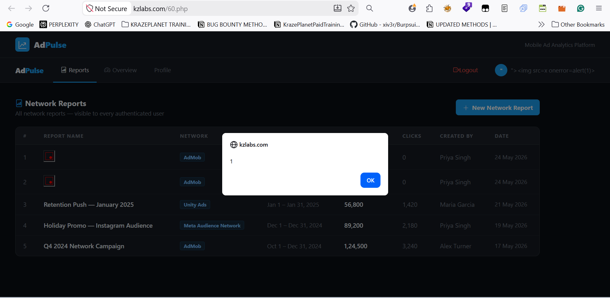
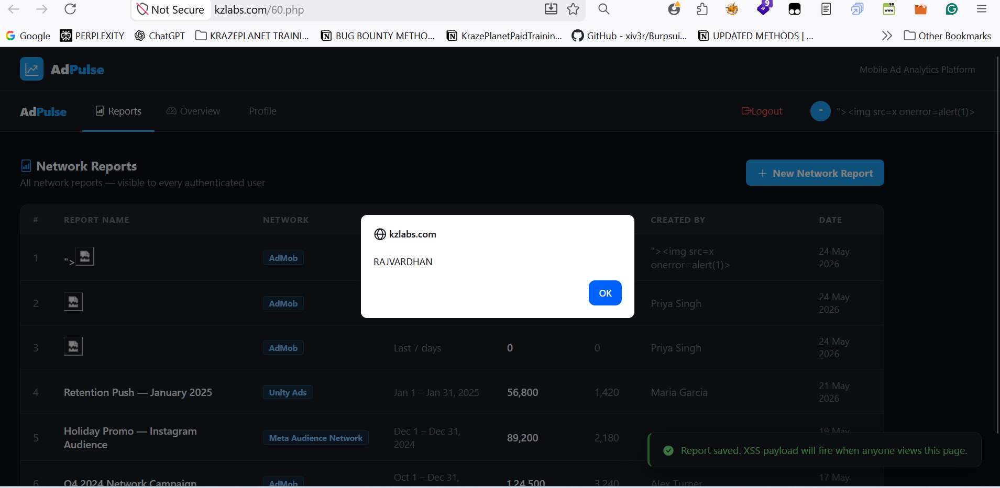

# Title
Stored Cross-Site Scripting (XSS) via Report Name Field in Network Reports

# Vulnerability Type
Stored XSS

# Summary
While testing the application, I found that the "Report Name" field inside the "New Network Report" functionality does not properly sanitize or encode user-supplied input before storing and rendering it back to users.

By injecting a malicious payload into the Report Name field, arbitrary JavaScript gets stored in the application and automatically executes whenever the affected page or stored data is viewed.

Since the payload is persistent, every authenticated user visiting the affected page can trigger the payload execution, including administrators and potentially privileged users.

# Vulnerable Endpoint
https://kzlabs.com/60.php

Vulnerable Parameter: Report Name field inside the "New Network Report" form

# Steps to Reproduce
1. Navigate to:
https://kzlabs.com/60.php
2. Log in with a valid account.
3. Open the "New Network Report" functionality.
4. In the "Report Name" field, enter the following payload:
">
5. Fill in the remaining required fields and submit the request.
6. After the report is created, revisit the Network Reports page.
7. Observe that a JavaScript alert box appears automatically.
8. The payload remains stored and executes whenever the affected page is viewed.

# Payload Used
">

# Proof of Concept

## Screenshot 1 — Malicious payload submitted through the New Network Report functionality

## Screenshot 2 — Stored payload executing automatically when the reports page loads

This confirms the presence of a Stored Cross-Site Scripting (XSS) vulnerability.
# Impact

- Steal session cookies of authenticated users
- Session hijacking
- Arbitrary JavaScript execution
- Phishing attacks
- Unauthorized actions performed on behalf of users
- Potential targeting of administrators or privileged users

Since the payload is stored server-side, the attack automatically affects users viewing the page without requiring malicious links.

# Remediation
1. Filter and sanitize dangerous HTML tags such as:
<script>

<svg>

2. Filter dangerous JavaScript event handlers and methods.
3. Apply proper output encoding before rendering user-controlled input into HTML responses.
4. If using PHP, use secure encoding functions such as:
   htmlspecialchars($input, ENT_QUOTES, 'UTF-8');
5. Avoid rendering raw user input directly into HTML contexts.
