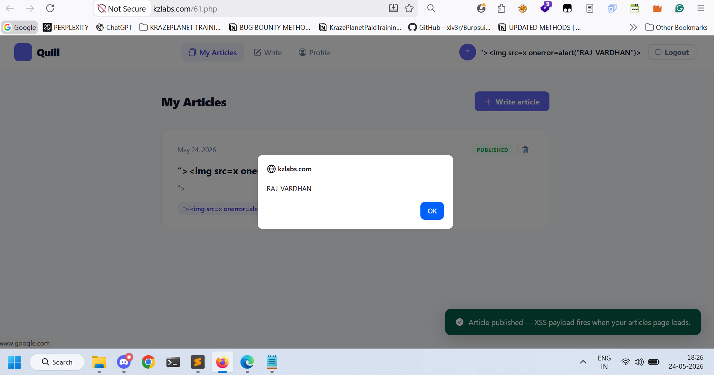

# Title
Stored Cross-Site Scripting (XSS) via Write Article Field

# Vulnerability Type
Stored XSS

# Summary
While testing the application, I found that the "Write Article" functionality does not properly sanitize or encode user-supplied input before storing and rendering it back to users.

By injecting a malicious payload into the article field, arbitrary JavaScript gets stored in the application and automatically executes whenever the affected article page is viewed.

Since the payload is persistent, every authenticated user visiting the affected page can trigger the payload execution, including administrators and potentially privileged users.

# Vulnerable Endpoint
https://kzlabs.com/61.php

Vulnerable Parameter: Write Article input field
# Steps to Reproduce
1. Navigate to:
https://kzlabs.com/61.php
2. Log in with a valid account.
3. Open the "Write Article" functionality.
4. In the article field, enter the following payload:

">

5. Submit the article.
6. After publishing the article, revisit the "My Articles" page.
7. Observe that a JavaScript alert box appears automatically.
8. The payload remains stored and executes whenever the affected article page is viewed.

# Payload Used

">

# Proof of Concept

## Screenshot 1 — Malicious payload stored inside the Write Article functionality

This confirms that arbitrary JavaScript can be stored and executed persistently when the article page is viewed.

# Impact

- Steal session cookies of authenticated users
- Session hijacking
- Arbitrary JavaScript execution
- Phishing attacks
- Unauthorized actions performed on behalf of users
- Potential targeting of administrators or privileged users

Since the payload is stored server-side, the attack automatically affects users viewing the page without requiring malicious links.

# Remediation
1. Filter and sanitize dangerous HTML tags such as:
<script>

<svg>

2. Filter dangerous JavaScript event handlers and methods like: alert(), confirm(), prompt() so even if a tag slips through the method won't execute

3. Apply proper output encoding before rendering user-controlled input into HTML responses.

4. If using PHP, use secure encoding functions such as:
   htmlspecialchars($input, ENT_QUOTES, 'UTF-8');

5. Avoid rendering raw user input directly into HTML contexts.
