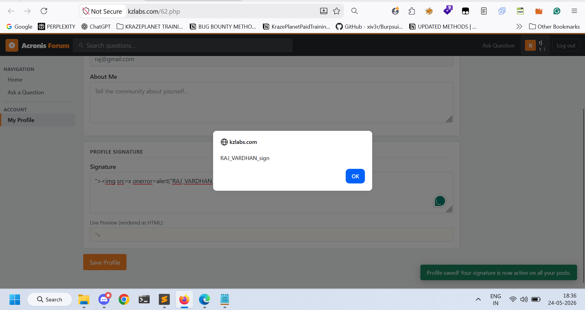

## Title
Stored Cross-Site Scripting (XSS) via Signature Field

## Vulnerability Type
Stored XSS

## Summary
While testing the application, I found that the "Signature" field does not properly sanitize or encode user-supplied input before storing and rendering it back to users.

By injecting a malicious payload into the Signature field, arbitrary JavaScript gets stored in the application and automatically executes whenever the affected page or profile section is viewed.

Since the payload is persistent, every authenticated user visiting the affected page can trigger the payload execution, including administrators and potentially privileged users.

## Vulnerable Endpoint
https://kzlabs.com/62.php

Vulnerable Parameter: Signature field

## Steps to Reproduce

1. Navigate to: `https://kzlabs.com/62.php`
2. Log in with a valid account.
3. Open the profile/settings section containing the Signature field.
4. In the Signature field, enter the following payload:
`">`
5. Save or update the profile/signature.
6. Revisit the affected page or profile section.
7. Observe that a JavaScript alert box appears automatically.
8. The payload remains stored and executes whenever the affected content is viewed.
Since the payload is stored server-side, the attack automatically affects users viewing the page without requiring malicious links.
## Payload Used

`">`

# Proof of Concept

This confirms the presence of a Stored Cross-Site Scripting (XSS) vulnerability in the Signature field.

## Screenshot 1 — XSS payload injected into the Signature field

# Impact
- Steal session cookies of authenticated users
- Session hijacking
- Unauthorized actions performed on behalf of users

# Remediation
1. Filter dangerous HTML tags like: `<script>, <svg>, , <iframe>` before saving user input into the database.

2. Block dangerous JavaScript event handlers like: `onload=, onerror=, onclick=`

3. Encode user input before rendering it back to the page.
4. If using PHP, use: `htmlspecialchars($input, ENT_QUOTES, 'UTF-8');`
