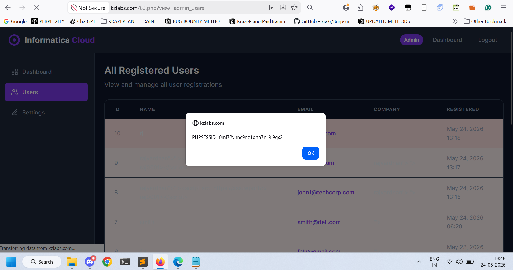
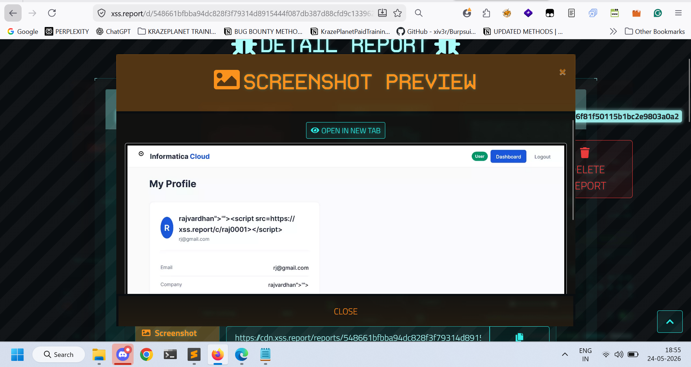
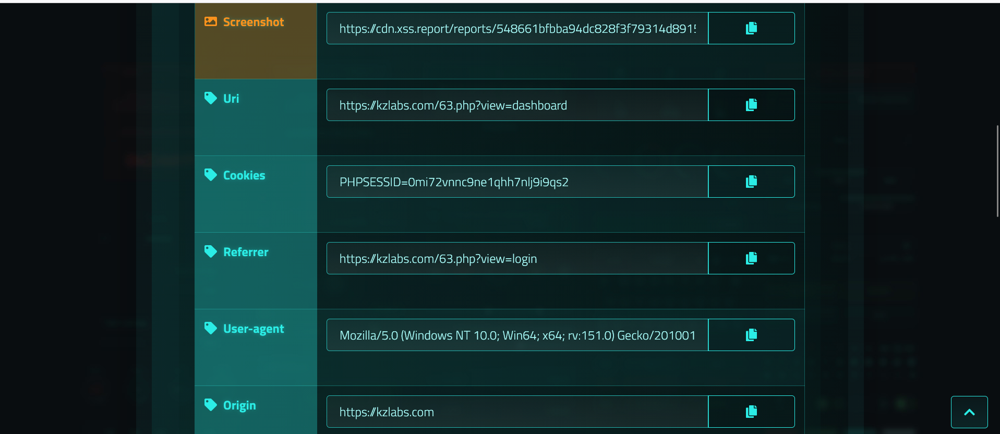

# Title
Stored Blind Cross-Site Scripting (Blind XSS) via Company Name Field

# Vulnerability Type
Stored Blind XSS

# Summary
While testing the application, I found that the "Company Name" field does not properly sanitize or encode user-supplied input before storing and rendering it inside the admin dashboard.
By injecting a malicious payload into the Company Name field, arbitrary JavaScript gets stored in the application and executes when an administrator or another privileged user views the affected page.

The payload was successfully triggered on the following admin endpoint:

  https://kzlabs.com/63.php?view=dashboard

This confirms the presence of a Stored Blind XSS vulnerability affecting privileged users.

# Vulnerable Endpoint
https://kzlabs.com/63.php?view=dashboard

Vulnerable Parameter: Company Name field
# Steps to Reproduce

1. Navigate to the application registration/profile form containing the Company Name field.
2. In the Company Name field, enter the following payload:

3. Submit the form/request.
4. Wait for an administrator or privileged user to access the admin dashboard.
5. Visit the following page as an administrator:

https://kzlabs.com/63.php?view=dashboard
6. Observe that the JavaScript payload executes automatically and displays the session cookie.

# Payload Used

# Proof of Concept
# Proof of Concept

## Screenshot 1 — Blind XSS payload stored successfully in the Company Name field

## Screenshot 2 — Payload execution triggered inside the admin dashboard

## Screenshot 3 — Administrator session cookie displayed through document.cookie

# Impact

- Steal administrator session cookies
- Account takeover of privileged users
- Arbitrary JavaScript execution in admin context
- Phishing attacks targeting administrators
- Unauthorized administrative actions
- Persistent client-side compromise affecting all dashboard viewers

Since the payload is stored server-side and triggered later inside the admin dashboard, this vulnerability can be leveraged to compromise privileged accounts without requiring direct interaction from the attacker.

# Remediation
1. Filter dangerous HTML tags like:
<script>, <svg>, , <iframe>
before saving user input into the database.

2. Block dangerous JavaScript event handlers like:
onload=, onerror=, onclick=

3. Encode user input before rendering it back to the page.

4. If using PHP, use:
htmlspecialchars($input, ENT_QUOTES, 'UTF-8');
