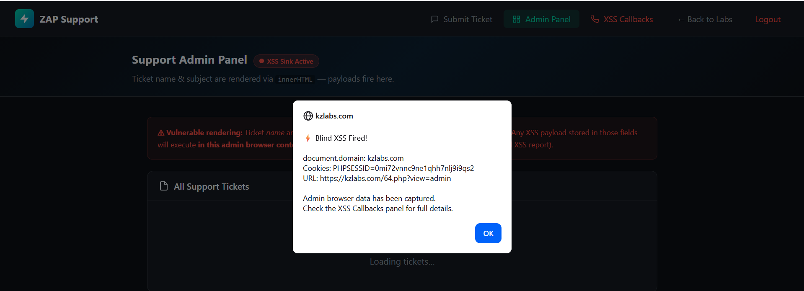
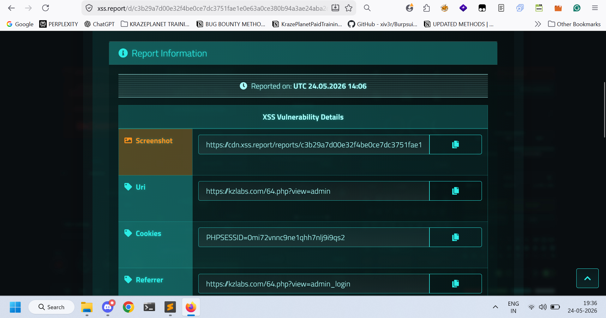

# Title
Stored Blind Cross-Site Scripting (Blind XSS) via Live Chat Form

# Vulnerability Type
 Blind XSS

# Summary
While testing the application, I found that the Live Chat functionality does not properly sanitize or encode user-supplied input before storing and rendering it to administrators or support staff.

By injecting a malicious JavaScript payload into the chat input field, arbitrary JavaScript gets stored in the application and executes when an administrator or support staff member views the affected chat message.
The payload successfully triggered a request to the external XSS interaction server, confirming the presence of a Stored Blind XSS vulnerability.

# Vulnerable Endpoint
https://kzlabs.com/64.php

Vulnerable Parameter: Live Chat input field
# Steps to Reproduce

1. Navigate to:
https://kzlabs.com/64.php
2. Open the Live Chat functionality.
3. In the chat/message field, enter the following payload:
'">
4. Submit the message.
5. Wait for an administrator or support staff member to view the chat panel.
6. Observe that the payload triggers a request to the external XSS interaction server.
7. This confirms that arbitrary JavaScript executes in the administrator/support dashboard context.

# Payload Used

'">

# Proof of Concept
## Screenshot 1 — Blind XSS payload submitted through the Live Chat form

## Screenshot 2 — Blind XSS callback triggered when viewed by administrator/support staff

This confirms that the injected JavaScript payload was successfully stored and later executed in the privileged user context.

# Impact

- Steal administrator or support staff session cookies
- Account takeover of privileged users
- Arbitrary JavaScript execution in admin context
- Access sensitive dashboard data
- Perform unauthorized administrative actions
- Persistent compromise affecting all users viewing the malicious chat message

Since the payload is stored server-side and triggered later when viewed by privileged users, this vulnerability can be leveraged to compromise internal administrative accounts.

# Remediation

1. Filter dangerous HTML tags like:
<script>, <svg>, , <iframe>
before saving user input into the database.

2. Block dangerous JavaScript event handlers like:
onload=, onerror=, onclick=

3. Encode user input before rendering it back to the page.

4. If using PHP, use:
htmlspecialchars($input, ENT_QUOTES, 'UTF-8');
